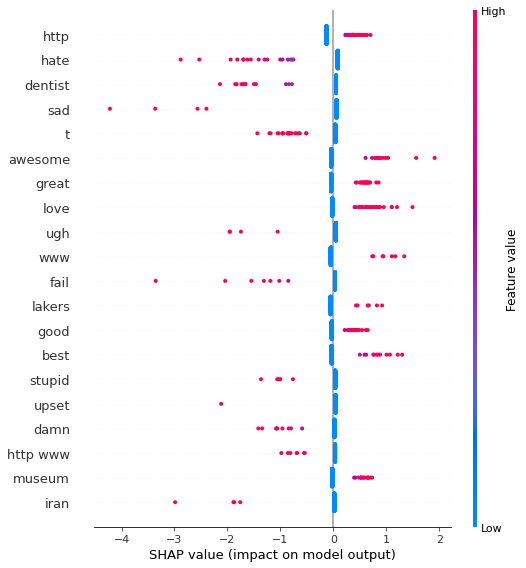
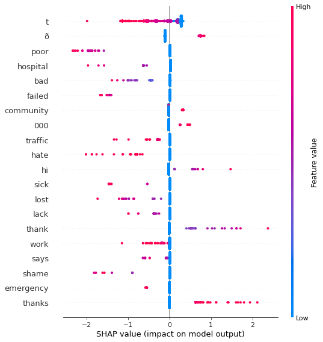
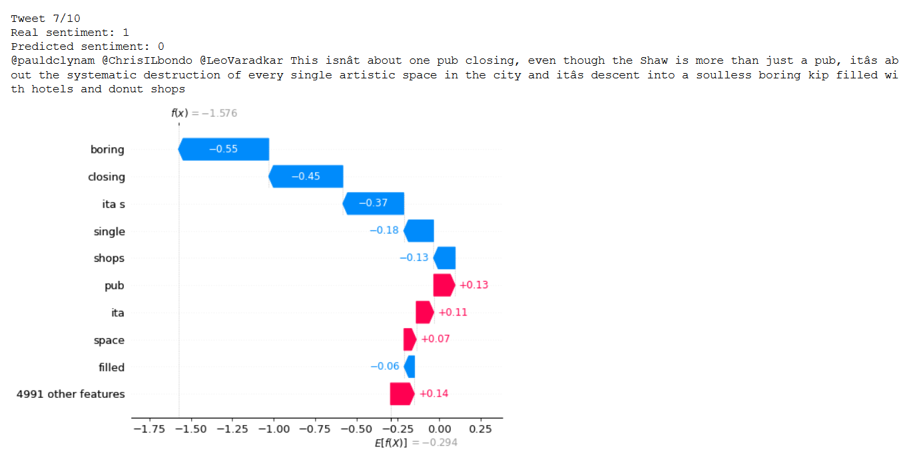
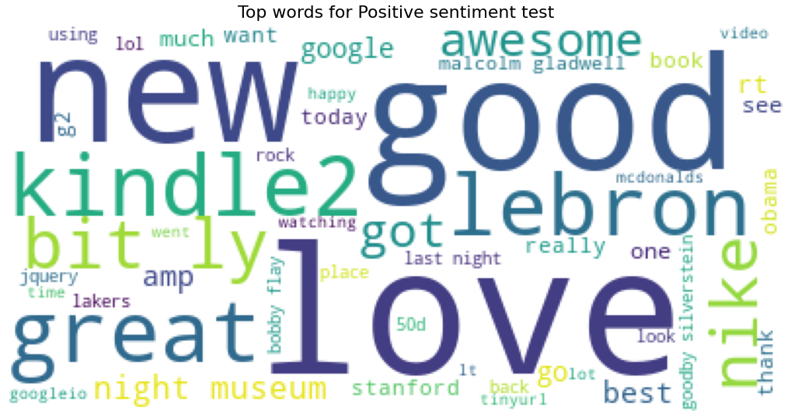
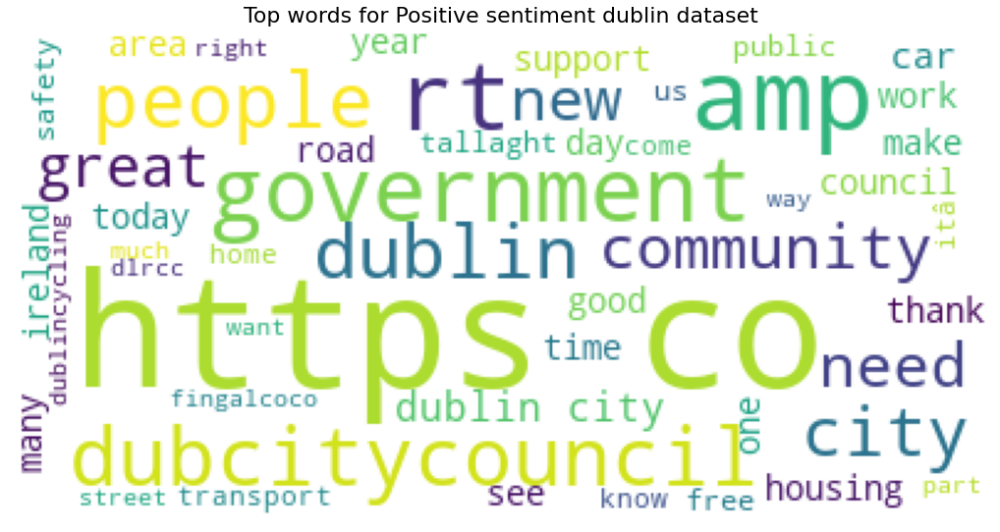

# Sentiment-Analysis
Sentiment analysis using Machine Learning models (BERT, LightGBM, Logistic Regression) 

# Summary
The goal is predict sentiment of a dataset from the Dublin City Council. To do this task, the public dataset Sentiment140 has been used to train Machine Learning models. Three different algorithms has been tested:
* Logistic regression 
* LightGBM
* BERT

## Metrics
The BERT model outperform significantly the LightGBM and Logistic Regression models (Accuracy of ~0.70 vs ~0.65). 
However, all models performed worst  in the dublin dataset compare to the test set in sentiment140 dataset. This indicate that text in dublin dataset is somehow different. 
Regarding to the accuracy by category, the specific metrics for each category are summary in each notebook. There is no a substantial difference between categories using Logistic Regression and LightGBM. However, BERT has lower accuracy for Community and Culture (0.67) than the rest of categories.

To further understand models errors in the dublin dataset, a Name Entity Recognition model like BERT could be used. Extracting entities (persons, locations, companies) and analyzing model performance depending on entities in text.

### Logistic Regression
| Metric | Train | Test | Dublin dataset |
| ----- | --- | ----- |  ----- |
| Accuracy | 0.770 | 0.811 | 0.653 |
| f1 | 0.78 | 0.82 | 0.61 |
| recall | 0.80 | 0.85 | 0.55 |
| precision | 0.76 | 0.79 | 0.69 |

### LightGBM Regression
| Metric | Train | Test | Dublin dataset |
| ----- | --- | ----- |  ----- |
| Accuracy | 0.795 | 0.783 | 0.63 |
| f1 | 0.80 | 0.80 | 0.62 |
| recall | 0.83 | 0.85 | 0.61 |
| precision | 0.78 | 0.75 | 0.64 |

### BERT
| Metric | Train | Test | Dublin dataset |
| ----- | --- | ----- |  ----- |
| Accuracy | 0.874 | 0.861 | 0.692 |
| f1 | 0.87 | 0.86 | 0.67 |
| recall | 0.86 | 0.86 | 0.62 |
| precision | 0.88 | 0.87 | 0.72 |

## Model interpretability
SHAP technique has been used to understand feature importance and correlations between feature and model predictions. In both models the typical positive/negative words are learned correctly. In the LightGBM some characters are the most important features, this should be further analyze. Probably a better cleaning and preprocess techniques have to be used.
### SHAP Logistic Regression

### SHAP LightGBM

Moreover, SHAP has been applied to understand individual predictions (focus in wrong predictions) and how each features has been used to generate individual output. Detailed analysis should be done to understand model errors and how to improve preprocessing and feature engineering. For example, in image below we see a text fromo dublin dataset that it is label as positive sentiment but could be argue that it is negative or at least neutral.

## TF-IDF Analysis
Looking to the words with higher TFIDF values (notebook 00_Logistic regression) we can see that in sentiment140 dataset the top word are:
* Positive common words: good, love, great, awesome, lol
* Negative common words: hate, suck, shit.
* Personalities, commercial names, places: Lebron, Obama, Peloshi, kindle2, stanford, North Korea, Iran.

In the dublin dataset top TFIDF words are related with public institutions and city topics (government, dubcitycouncil, people, community, homeless). The top words are much more topic specific that in the sentiment140 dataset.

> ## Next steps
> ### DATA
1.   In-depth Exploration Data Analysis to get a better understand of text.
2.   Analyze in detail model errors on dublin dataset.
3.   Find a better dataset to fine tune BERT.
4.   Create new variables from raw text (i.e. number of words, capital letter, emoticons, etc).
5.   Use NER model to extract entities and analyze model performance. Generate new features based in these entities extracted.
6.   Improve data cleaning and preprocessing for Logistic Regression and LightGBM(stopwords, lematization).

> ### MODEL
1.   Try novel architectures like GPT3.
2.   Train with complete dataset in both BERT and LightGBM.
3.   Add early stopping in training.

> ### SOFTWARE
1.   Define a requirement with libraries versions to version problem. Ideally, create a docker file to solve operative system incompatibilities.
2.   Create technical and functional documentation.
3.   Create a file with parameters.
4.   Create unit testing of functions.
5.   Add Logger class.
